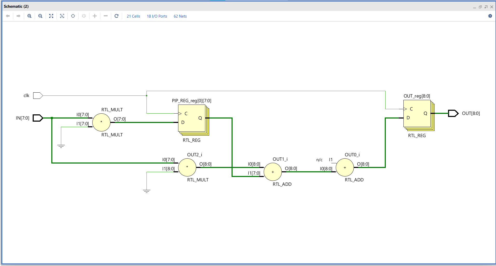
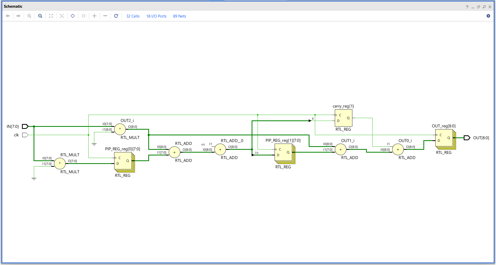
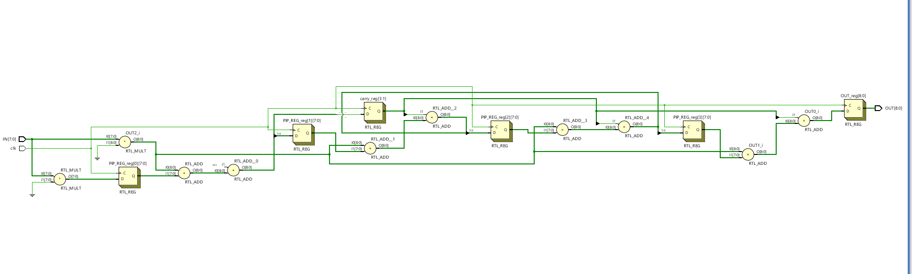

# PIPELINED FIR FILTER
> *This is pipelined FIR filter with n th order , where n is specified by used it uses only n registers of each 8 bits size*

### RTL DESCRIPTION OF 1st ORDER FIR FILTER 

### RTL DESCRIPTION OF 2nd ORDER FIR FILTER 

### RTL DESCRIPTION OF 4th ORDER FIR FILTER 

